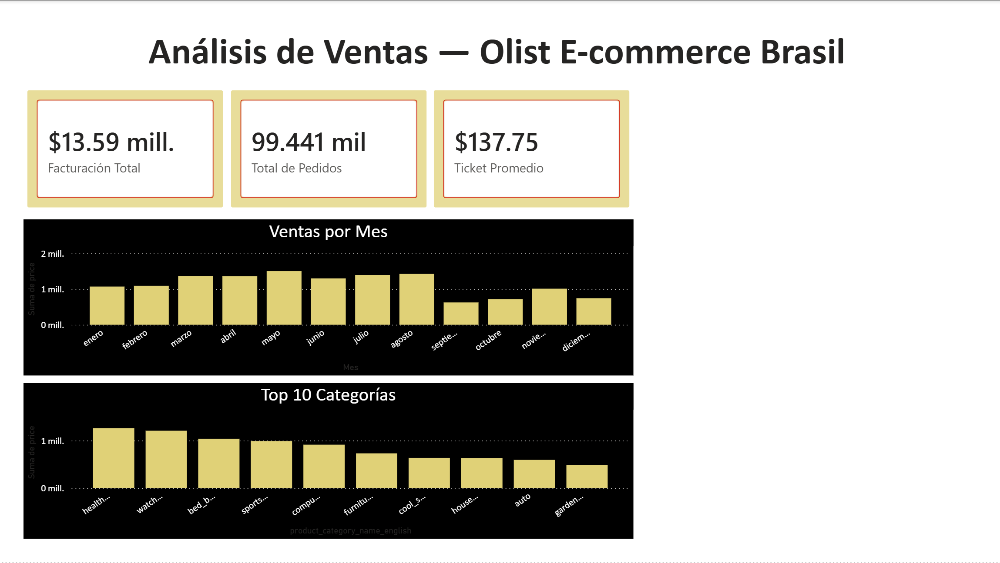

# Análisis de Ventas — Olist E-commerce Brasil

Dashboard desarrollado en Power BI sobre el dataset público de Olist,
plataforma brasileña de e-commerce con presencia en todo Brasil.

## Dataset
- **Fuente:** [Kaggle — Brazilian E-Commerce Public Dataset by Olist](https://www.kaggle.com/datasets/olistbr/brazilian-ecommerce)
- **Volumen:** 99,441 pedidos analizados
- **Tablas utilizadas:** orders, order_items, products, product_category_name_translation

## KPIs principales
| Métrica | Valor |
|---|---|
| Facturación total | $13.59 millones |
| Total de pedidos | 99,441 |
| Ticket promedio | $137.75 |

## Hallazgos
- **Mayo** es el mes de mayor facturación (~$1.5M)
- **Health & Beauty** es la categoría líder en ventas
- Caída notable en septiembre, posible oportunidad estacional
- Las categorías watches_gifts y bed_bath_table completan el top 3

## Herramientas
Power BI · DAX · Modelado de datos

## Vista previa

